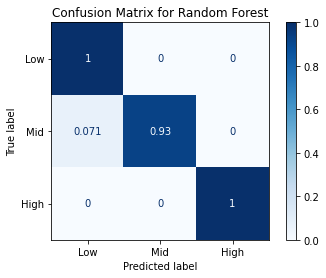
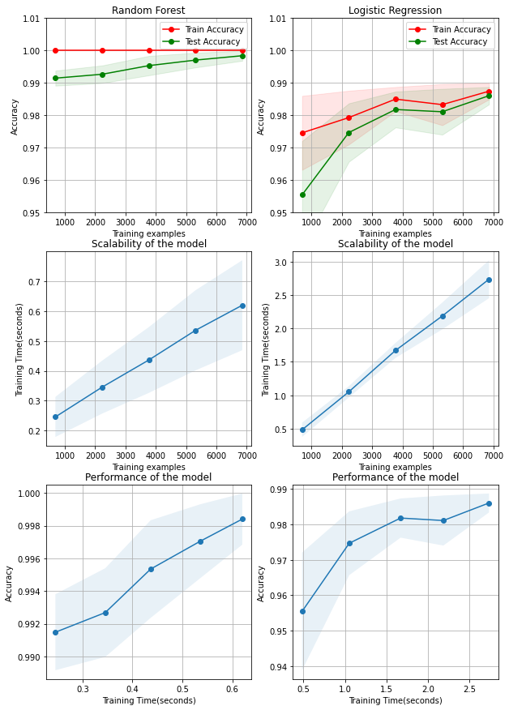

# Infection susceptibility prediction using ML algorithms

We trained a Random Forest Classifier to predict the which category of risk does a person lie in when it comes to infection susceptibility and obtained **99.91 % accuracy on test dataset**.

## Confusion Matrix of Random Forest

## Preprocessing
1. Taking care of missing data using the "mean" strategy.
2. Label/One hot encoding categorical classes.
3. Exploring correlation matrix to understand features that contribute/not contribute to output label.
4. Training the model with an open source dataset.
5. Obtaining confusion matrix to check how models performed.
6. Comparing factors like scalability and performance.

## Scalability comparison of top 2 models
