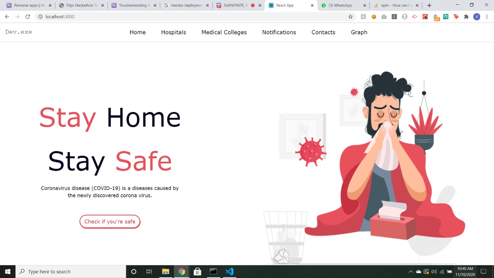
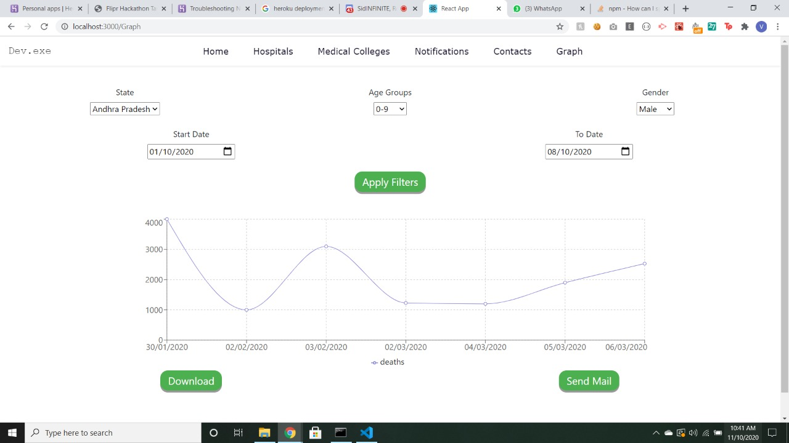

# React.js Front End

## Screenshots of the required website

## Node.js Backend

1. To upload individual data.

"https://vithack2020-covid-problems.herokuapp.com/"
with body like

{
    "patientId": 1,
    "reportedOn": "30/01/2020",
    "onsetEstimate": "",
    "ageEstimate": 20,
    "gender": "female",
    "city": "Thrissur",
    "district": "Thrissur",
    "state": "Kerala",
    "status": "Recovered",
    "notes": "Travelled from Wuhan"
}

2. The filtering processes can be done through this end point

"https://vithack2020-covid-problems.herokuapp.com/get_filtered_data"

with body like

{
	"start":{
		"day":1,
		"month":3,
		"year":2020
	},
	"end":{
		"day":15,
		"month":3,
		"year":2020
	},
	"filter":{
	}
}

